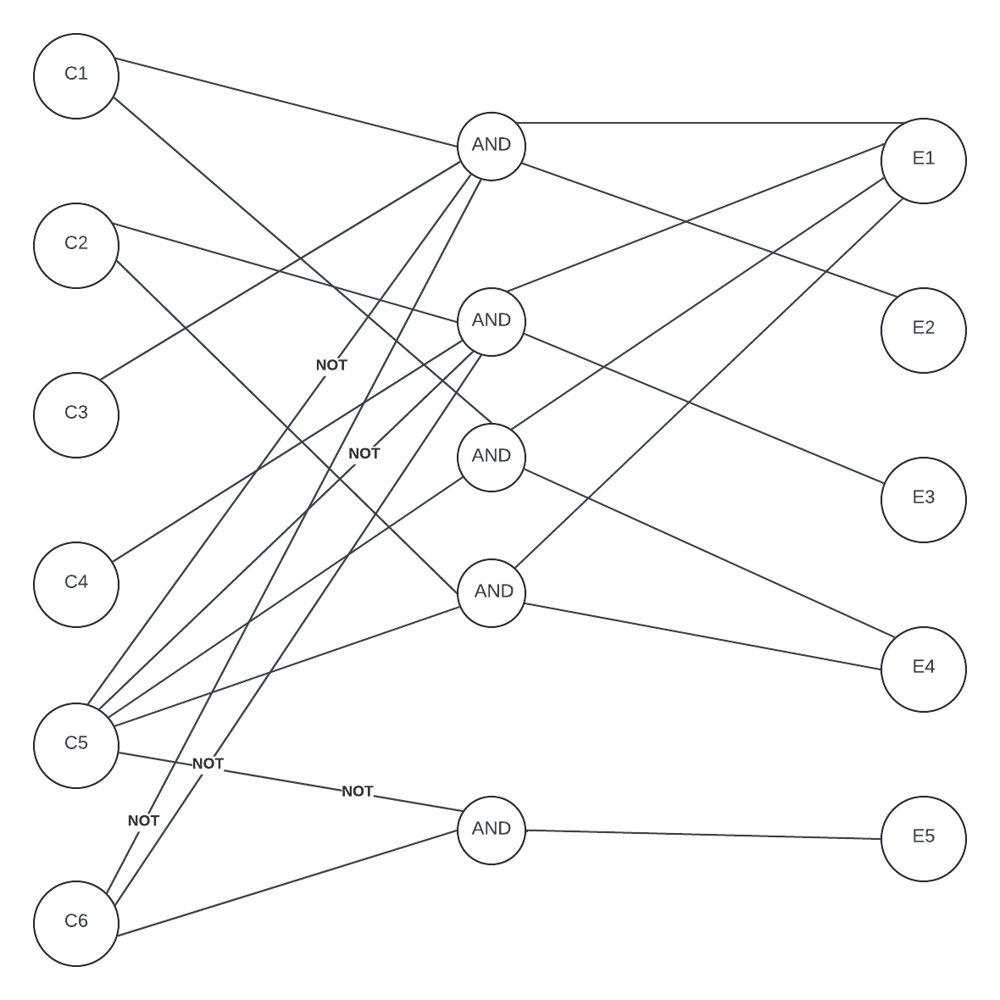

Name: Michael Quach
Student number: 300177284

-------------------------Problem 1-------------------------

Easter Question 1.1:

| ID | Input Condiiton | Valid Classes | Invalid Classes | Boundary Values | Description |
| --- | --- | --- | --- | --- | --- |
| 1 | year | 1583 < year < 4099 | years between 1584 and 4098 inclusive | Years before 1584 and years after 4098 |1583, 1584, 4098, 4099| Valid years |
| 2 | year | year = 1954, 1981, 2049, 2076 | years outside the valid classes | all years + 1955 | Special year, subtract 7 |
| 3 | year | year where 22 < March < 32 |1818, 2002 | 2018 | Easter in March |
| 4 | year | 31 < March < 57 | 2018, 2038 | 2002 | Easter in April |

Earliest possible easter date: March 23
Latest possible easter date: April 25

Easter Question 1.2

| Test Case Number | Test Data (year) | Expected Results | Cover Equivalence | Boundary Values |
| --- | --- | --- | --- | --- |
| 1 | 1584 | April 4  | 1,  4 | 1584 (min_year)
| 2 | 4098 | March 29  | 1,  3 | 1584 (max_year)
| 3 | 1954 | April 18 | 1, 2, 4 | 1954 (spec_year)
| 4 | 1981 | April 19 | 1, 2, 4 | 1981 (spec_year)
| 5 | 2049 | April 18 | 1, 2, 4 | 2049 (spec_year)
| 6 | 2076 | April 19 | 1, 2, 4 | 2076 (spec_year)
| 7 | 1583 | null | 1 | out_of_range
| 8 | 4099 | null | 1 | out_of_range
| 9 | 2002 | March 31 | 1, 2 | March 31 (last_march)
| 10 | 1818 | March 23 | 1, 2 | Earliest possible easter date (first_march)
| 11 | 2018 | April 1 | 1, 4 | First date in April (first_april)
| 12 | 2038 | April 25 | 1, 4 | Last date in April (last_april)

Easter Question 1.3
See EasterClaculatorTest.java for solutions.

Easter Question 1.4

| Test Case Number | Expected Results | Actual Results | Verdict (Pass/Fail) |
| --- | --- | --- | --- | --- |
| 1 | April 4 | April 4 | pass |
| 2 | March 29 | March 29 | pass |
| 3 | April 18 | April 18 | pass |
| 4 | April 19 |April 19 | pass |
| 5 | April 18 | April 25| fail |
| 6 | April 19 | April 19 | pass |
| 7 | null | null | pass |
| 8 | null | April 11 | fail |
| 9 | March 31 | March 31 | pass |
| 10 | March 23 | March 23 | pass |
| 11 | April 1 | March 32 | fail |
| 12 | April 25 | April 25 | pass |

-------------------------Problem 2-------------------------

Question 2.1 Causes and Effects

For an up directions, assume that NOT is the down direction in the cause and effect graph.

C1. The Elevator is going up.
C2. The Elevator is going down.
C3. Elevator floor up-button is pressed.
C4. Elevator floor down-button is pressed.
C5. Elevator floor request button is pressed.
C6. Elevator charge is above the threshold.

Effects
E1. Elevator stops at a floor.
E2. Floor up-button light turns off.
E3. Floor down-button light turns off.
E4. Corresponding elevator floor request button light turns off.
E5. Elevator passes floor without stopping.

Question 2.2

See assets folder

 

Question 2.3

E1, E2:
(C1^C3^~C5^~C6) 

E1, E3:
(C2^C4^~C5^~C6)

E1, E4:
(C1^C5)V(C2^C5)

E5:
(~C5 ^ C6)

Question 2.4

Each P is a condition from question 2.3
i.e P1 = (C1^C3^~C5^~C6) 
P2 = (C2^C4^~C5^~C6)
P3 = (C1^C5)
P4 = (C2^C5)
P5 = (~C5 ^ C6)

|Cause| P1  | P2  | P3  | P4  | P5  |
| --- | --- | --- | --- | --- | --- |
| C1  |  T  |  F  |  T  |  -  |  F  |
| C2  |  F  |  T  |  -  |  T  |  F  |
| C3  |  T  |  F  |  F  |  F  |  F  |
| C4  |  F  |  T  |  F  |  F  |  F  |
| C5  |  F  |  F  |  T  |  T  |  F  |
| C6  |  F  |  F  |  F  |  F  |  T  |

|Effect| P1  | P2  | P3  | P4  | P5 |
| --- | --- | --- | --- | --- | --- |
| E1  |  T  |  T  |  T  |  T  |  F  |
| E2  |  T  |  F  |  F  |  F  |  F  |
| E3  |  F  |  T  |  F  |  F  |  F  |
| E4  |  F  |  F  |  F  |  T  |  F  |
| E5  |  F  |  F  |  F  |  F  |  T  |

Question 2.5
| TC #| C1  | C2  | C3  | C4  | C5  | C6  | Result |
| --- | --- | --- | --- | --- | --- | --- | ------ |
| TC1 |  T  |  F  |  T  |  F  |  F  |  F  | E1, E2 |
| TC2 |  T  |  T  |  F  |  F  |  T  |  F  | E1, E4 |
| TC3 |  T  |  T  |  F  |  F  |  T  |  F  | E1, E4 |
| TC4 |  F  |  T  |  F  |  T  |  F  |  F  | E1, E3 |
| TC5 |  F  |  F  |  F  |  F  |  F  |  T  | E5     |