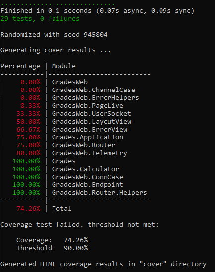

Name: Michael Quach
Student number: 300177284

Question 1.1
See control_flow.jpg for the control flow graph.
Each numbered node corresponds with each line of code in the original calculator.ex file.

Question 1.2
Lines of conditions and branches covered correspond and are from the original code.

| Test Case Number | Test Data  | Expected Results | Conditions Covered | Branches covered |
| --- | --- | --- | --- | --- |

Test Cases for percentage_grade
| TC1 | homework: 0.8, labs:[1, 1, 1], midterm: 0.70, final: 0.9 | 85 | Line 6, Line 13 | Line 7, Line 14 |
| TC2 | homework: [], labs:[], midterm: 0.70, final: 0.9 | 41 | Line 4, Line 11 | Line 5, Line 12 |

Test Cases for letter_grade
| TC3 | homework: [], labs:[], midterm: 0, final: 0 | "EIN" | Line 23, Line 30, avg_homework < 0.4, avg_exams < 0.4, num_labs < 3 | Line 24, Line 31, Line 44 |
| TC4 | homework: [1], labs:[1, 1, 1], midterm: 1, final: 1 | "A+" | Line 25, Line 32, Line 45, Line 49 | Line 26, Line 33, Line 49 |
| TC5 | homework: [1], labs:[1, 1, 1], midterm: 0.4, final: 1 | "A" | Line 25, Line 32, Line 45, Line 50 | Line 26, Line 33, Line 50 |
| TC6 | homework: [1], labs:[1, 1, 1], midterm: 0, final: 1 | "A-" | Line 25, Line 32, Line 45, Line 51 | Line 26, Line 33, Line 51 |
| TC7 | homework: [1, 0], labs:[1, 1, 1, 0, 0], midterm: 1, final: 1 | "B+" | Line 25, Line 32, Line 45, Line 52 | Line 26, Line 33, Line 52 |
| TC8 | homework: [1, 0], labs:[1, 1, 1, 0, 0], midterm: 0.65, final: 1 | "B" | Line 25, Line 32, Line 45, Line 53 | Line 26, Line 33, Line 53  |
| TC9 | homework: [1, 0], labs:[1, 1, 1, 0, 0], midterm: 0.5, final: 1 | "C+" | Line 25, Line 32, Line 45, Line 54| Line 26, Line 33, Line 54  |
| TC10 | homework: [1, 0], labs:[1, 1, 1, 0, 0], midterm: 0.3, final: 1 | "C" | Line 25, Line 32, Line 45, Line 55 | Line 26, Line 33, Line 55  |
| TC11 | homework: [1, 0], labs:[1, 1, 1, 0, 0], midterm: 0, final: 1 | "D+" | Line 25, Line 32, Line 45, Line 56 | Line 26, Line 33, Line 56  |
| TC12 | homework: [1, 0], labs:[1, 1, 1, 0, 0], midterm: 1, final: 0.1 | "D" | Line 25, Line 32, Line 45, Line 57 | Line 26, Line 33, Line 57  |
| TC13 | homework: [1, 0], labs:[1, 1, 1, 0, 0], midterm: 1, final: 0 | "E" | Line 25, Line 32, Line 45, Line 58 | Line 26, Line 33, Line 58 | 
| TC14 | homework: [0.4, 0.4], labs:[.2, .2, .2, .2, .2], midterm: 0.8, final: 0 | "F" | Line 25, Line 32, Line 45, Line 59 | Line 26, Line 33, Line 59  |

Test Cases for numeric_grade
| TC15 | homework: [], labs:[], midterm: 0, final: 0 | 0 | Line 66, Line 73, avg_homework < 0.4, avg_exams < 0.4, num_labs < 3 | Line 67, Line 74, Line 87 |
| TC16 | homework: [1], labs:[1, 1, 1], midterm: 1, final: 1 | 10 | Line 68, Line 75, Line 88, Line 92 | Line 69, Line 76, Line 92 |
| TC17 | homework: [1], labs:[1, 1, 1], midterm: 0.4, final: 1 | 9 | Line 68, Line 75, Line 88, Line 93 | Line 69, Line 76, Line 93 |
| TC18 | homework: [1], labs:[1, 1, 1], midterm: 0, final: 1 | 8 | Line 68, Line 75, Line 88, Line 94 | Line 69, Line 76, Line 94 |
| TC19 | homework: [1, 0], labs:[1, 1, 1, 0, 0], midterm: 1, final: 1 | 7 | Line 68, Line 75, Line 88, Line 95 | Line 69, Line 76, Line 95 |
| TC20 | homework: [1, 0], labs:[1, 1, 1, 0, 0], midterm: 0.65, final: 1 | Line 68, Line 75, Line 88, Line 96| Line 69, Line 76, Line 96 |
| TC21 | homework: [1, 0], labs:[1, 1, 1, 0, 0], midterm: 0.5, final: 1 | Line 68, Line 75, Line 88, Line 97 | Line 69, Line 76, Line 97 |
| TC22 | homework: [1, 0], labs:[1, 1, 1, 0, 0], midterm: 0.35, final: 1 | 4 | Line 68, Line 75, Line 88, Line 98 | Line 69, Line 76, Line 98 |
| TC23 | homework: [1, 0], labs:[1, 1, 1, 0, 0], midterm: 0, final: 1 | 3 | Line 68, Line 75, Line 88, Line 929 | Line 69, Line 76, Line 99 |
| TC24 | homework: [1, 0], labs:[1, 1, 1, 0, 0], midterm: 1, final: 0.1 | 2 | Line 68, Line 75, Line 88, Line 100 | Line 69, Line 76, Line 100 |
| TC25 | homework: [1, 0], labs:[1, 1, 1, 0, 0], midterm: 1, final: 0 | 1 | Line 68, Line 75, Line 88, Line 101 | Line 69, Line 76, Line 101 |
| TC26 | homework: [0.4, 0.4], labs:[.2, .2, .2, .2, .2], midterm: 0.8, final: 0 | 0 | Line 68, Line 75, Line 88, Line 102 | Line 69, Line 76, Line 102 |

Question 1.4
See assignment02/assets for the coverage.
 

I was able to achieve 100% statement coverage with my test cases.

To address these limitations, we can possibly use other tools to check other kinds of coverage if they exist.

Question 2.1-2.4:

See updated code in assignment02/grades/lib/grades/calculator ex.