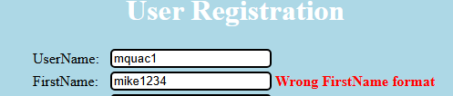
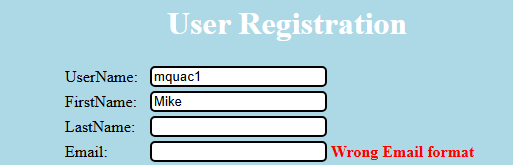

Exercise 1

Some equivalence classes from tutorial 1:

Some Username classes
EC-U-letter1 VALID
EC-U-6-12 VALID
EC-U-Empty INVALID
EC-U-NotLetter1 INVALID
EC-U-Not_letters_digits INVALID

Some First name classes
EC-FN-Letters_spaces VALID
EC-FN-Notletter1 INVALID

Some email classes
EC-EM-Empty INVALID (email is not empty)

ID | Test Case        | Expected results | Actual Results | Verdict (Pass, Fail, Inconclusive)
-- | ---------------  | ---------------- | -------------- | ----------------------------------
 1 | U = mquac1       |       Valid      |      INVALID   | Pass
 2 | U = mquac1       |       Invalid    |      INVALID   | Fail
 # | FN = mike1234    |                  |                |
 3 | U = mquac1       |       Invalid    |      INVALID   | Fail
 # | FN = Mike                 
 # | Email = "" (empty)|
   
 

